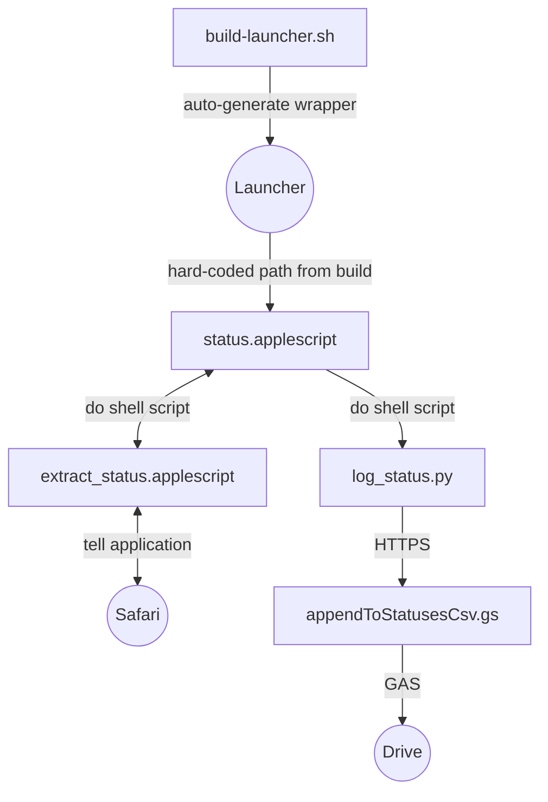

# Discord Status Logger

A reusable MacOS application to automatically extract my Discord custom status and append it to my log file in Google Drive.

## Motivation

This is in a way a successor to the Discord side of my [counters program](https://github.com/vinlin24/counters) (which itself absorbed [status-logger](https://github.com/vinlin24/status-logger)). These programs used [Selenium](https://www.selenium.dev) to automatically extract my daily Discord custom status and log it to a local CSV file. However:

- I have since activated 2FA on my Discord account, making login impossible on my current Selenium setup. I tried initializing the driver with custom profiles, but I couldn't get that to work either (I recall finally fixing it but there was something about requiring all other Edge windows to be closed for my custom profile to work, which is kind of a dealbreaker).
- I have mostly switched to the Apple ecosystem, where Safari natively supports JavaScript automation through [AppleScript](https://developer.apple.com/library/archive/documentation/AppleScript/Conceptual/AppleScriptLangGuide/introduction/ASLR_intro.html).
- I have since moved away from local logging and instead maintain a CSV file in my Google Drive (and thus get free backup & access from any device).
- Manually maintaining that file on Google Drive is bothersome because I need to go to Discord => copy my status => visit the Google Drive file => open with Text Editor => authorize Text Editor => authorization fails the first time for some un-reproducible reason (thanks Google) => finally launch Text Editor => jump to the bottom and manually add a CSV entry, including escaping/quoting the status. Granted, I did learn the CSV formatting rules this way. And no, I don't use Sheets because that messes up the formatting of dates and some statuses.
- Most importantly: Discord *still* has not exposed any API for getting a user's custom status 😡.

## Overview

Naturally, I must over-engineer my most trivial hobbies.

1. I use AppleScript to natively automate my Safari browser (no Discord login required) and extract the custom status, both text and emoji if applicable.
2. I use [Google Apps Script (GAS)](https://developers.google.com/apps-script) to expose a function that appends to my CSV file on Google Drive.
3. I use a Python script as the HTTP client to call my GAS deployment. To avoid manual authentication, the GAS has access set to everyone, and both client and webhook instead use a shared **secret** for authorization.

The GAS side of things is under [cloud/](cloud/), using [clasp](https://developers.google.com/apps-script/guides/clasp) to develop locally. The local side of things is under [src/](src/), including status extraction with AppleScript and status upload with Python.

### Script Flow

The scripts are connected as depicted:



### Requirements

| Script              | Mac Required?    | Other Notes                                                    |
| ------------------- | ---------------- | -------------------------------------------------------------- |
| `cloud/*`           | ❎ Runs on Google | Developed locally via `clasp` (an `npm` package)               |
| `*.applescript`     | ‼️ Yes lol        | Assumes `node`/`npm` is managed by [homebrew](https://brew.sh) |
| `build-launcher.sh` | ‼️ Yes            |                                                                |
| `log_status.py`     | ❎ Portable       | Requires Python (I think), assumes `clasp` is on PATH          |

## Setup

### Local Environment Recovery

1. Open the [Apps Script project](https://script.google.com/home) on Google Cloud.
2. Go to **Project Settings > Script Properties** to retrieve the `API_SECRET` property value.
3. Save that value in a `secret.txt` file at the project root (same directory as this README).
4. Set up [clasp](https://developers.google.com/apps-script/guides/clasp) again. You can infer `$SCRIPT_ID` from the URL of the Apps Script project.
     ```sh
     npm install -g @google/clasp
     clasp login
     clasp clone --rootDir cloud_build $SCRIPT_ID
     ```
5. Reinstall local dependencies.
     ```sh
     npm install
     ```

### AppleScript Launcher

To build the AppleScript launcher wrapper:

```sh
./build-launcher.sh
```

This will generate a `.app` in the project directory, which can be run via `open`, double-clicking in Finder, Spotlight Search, etc. Optionally move the `.app` to the applications folder:

```sh
mv *.app ~/Applications
```

The application merely delegates to [the AppleScript source files](src/) (file paths hard-coded during the build process). That is, the AppleScripts aren't actually compiled/bundled but rather run directly, from wherever the launcher is called. Thus, the source scripts are always "live" copies whose changes will be automatically reflected in future runs. You should never need to rebuild the launcher again unless there's a change in source code directory structure.

### Running Individual Scripts

The individual scripts representing steps within [the greater flow](#script-flow) are standalone and can be run directly too.

To just extract the status (returned as a two line string: text followed by emoji):

```sh
src/extract_status.applescript
```

To upload a status:

```sh
src/log_status.py "$STATUS_TEXT" "$STATUS_EMOJI"
```
